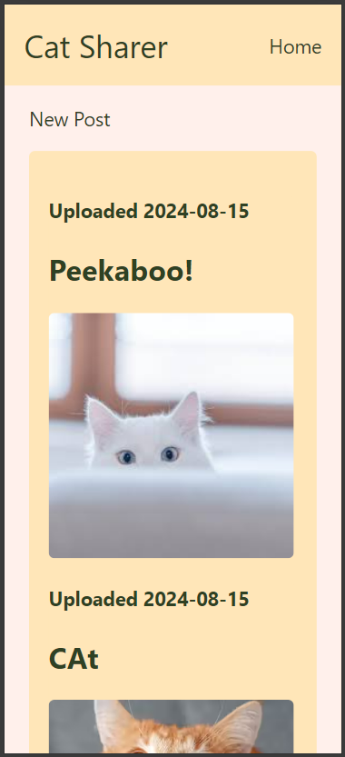

# The Design of a Database-Linked Website for NCEA Level 2

Project Name: **Cat Photo Website**

Project Author: **Corban Mooney**

Assessment Standards: **91892** and **91893**

-------------------------------------------------

## System Requirements

### Identified Need or Problem

Cat enthusiasts love sharing cat photos online, however it is often found annoying by non-cat owners. Having a dedi-***cat***-ed website would not only hide the photos from people who wish not to view them, but also allow for easier access to the photos for the people who want them.

### End-User Requirements

Cat enthusiasts come from all walks of life, and can be young or old. This means that any system must use clear and simple language, and be suitable for people of any age. It should be accessible in terms of colours and fonts used. 

The level of IT expertise of the users could vary from high to very low. This means that the system must be very intuitive to use. 

Cat photo sharers love cats, so the system should be nicely designed, possibly with a cat theme.

### Proposed Solution

I will make a safe website for people to share cat photos and discuss topics surrounding them. The system will include; Photo uploading, commenting, passwords on posts, editing, deleting, and reporting.

-------------------------------------------------

## Relevant Implications

### Usability

The usability implications of a digital technology or digital outcome (e.g. a website) relate to how easy it is to use for the end-user, without the need for help or guidance.

This website will need to be usable by anyone, this means it must be simple, easy to understand, and use.

I will need to consider what devices people will use on this website and try to make it easy to use. This could mean font size and colour, contrast, and the size of images and posts. I will make references back to Nielsen's usability heuristics to make my website as usable as possible.

### Functionality

The functionality implications of a digital technology or digital outcome (e.g. a website) relate to how well it works for the end-user, in terms of meeting its intended purpose.

The website must be functional for users, otherwise the website would be useless.

I will need to consider the database and how the system interacts with it (e.g. uploading photos from the website to the database.) I will do lots of testing to make sure that there isn't anything broken.

### Aesthetics

The aesthetic implications of a digital technology or digital outcome (e.g. a website) relate to how it looks in terms of design.

Most users will not use a website if it doesn't look up to their standards. Aesthetics can also help with usability.

The website should be pleasing to look at while still remaining easy to look at and figure out. I will work with my end-user to make sure the website looks both up to date, and cool.

### End-Users

The end-user implications of a digital technology or digital outcome (e.g. a website) are connected to the specific needs of the end-user(s).

Since the people using the website will all be from different backgrounds, tech experiences, and devices, the website must be simple yet intuitive.

To do this I must consider the simplicity and layout while also keeping the functionality, I must also make sure that the website works with most devices and the built-in functions of the browser (e.g. Chrome's translate website function)

### Intellectual Property

The intellectual property (IP) implications of a digital technology or digital outcome (e.g. a website) relate to not infringing on the IP of others, in terms of copyright, trade marks, patents, etc..

Since this is a website about sharing photos I must be weary of the photos that I personally put onto the website.

To do this I must look into every photo I personally put onto the website, this means I should try and keep my own photos/logos on the website and not other people's.

-------------------------------------------------

## Final System Design

### Database Structure

### User Interface Design

-------------------------------------------------

## Completed System

### Database Structure

### User Interface Design

This is the finalised design of the home page

-------------------------------------------------

## Review and Evaluation

### Meeting the Needs of the Users

Replace this text with a brief evaluation of how well you met the needs of your users. Look at what you initially wrote about who they are, what specific needs they have, etc. and discuss how well the system meets those needs.

### Meeting the System Requirements

Replace this text with a brief evaluation of how well you met the requirements that you defined at the start of the project, etc. Look back at the list of features / functionality you initially set and discuss how well your system has implemented each one.

### Review of IMPLICATION NAME HERE

Replace this text with brief notes showing how the implication was addressed in the final outcome. Accompany the notes with screenshots / other media to illustrate specific features.

### Review of IMPLICATION NAME HERE

Replace this text with brief notes showing how the implication was addressed in the final outcome. Accompany the notes with screenshots / other media to illustrate specific features.

### Review of IMPLICATION NAME HERE

Replace this text with brief notes showing how the implication was addressed in the final outcome. Accompany the notes with screenshots / other media to illustrate specific features.

-------------------------------------------------

### DATE HERE

Replace this test with what you are working on

Replace this text with brief notes describing what you worked on, any decisions you made, any changes to designs, etc. Add screenshots / links to other media to illustrate your notes where necessary.

### DATE HERE

Replace this test with what you are working on

Replace this text with brief notes describing what you worked on, any decisions you made, any changes to designs, etc. Add screenshots / links to other media to illustrate your notes where necessary.

### DATE HERE

Replace this test with what you are working on

Replace this text with brief notes describing what you worked on, any decisions you made, any changes to designs, etc. Add screenshots / links to other media to illustrate your notes where necessary.

### DATE HERE

Replace this test with what you are working on

Replace this text with brief notes describing what you worked on, any decisions you made, any changes to designs, etc. Add screenshots / links to other media to illustrate your notes where necessary.

### DATE HERE

Replace this test with what you are working on

Replace this text with brief notes describing what you worked on, any decisions you made, any changes to designs, etc. Add screenshots / links to other media to illustrate your notes where necessary.

### DATE HERE

Replace this test with what you are working on

Replace this text with brief notes describing what you worked on, any decisions you made, any changes to designs, etc. Add screenshots / links to other media to illustrate your notes where necessary.

### DATE HERE

Replace this test with what you are working on

Replace this text with brief notes describing what you worked on, any decisions you made, any changes to designs, etc. Add screenshots / links to other media to illustrate your notes where necessary.